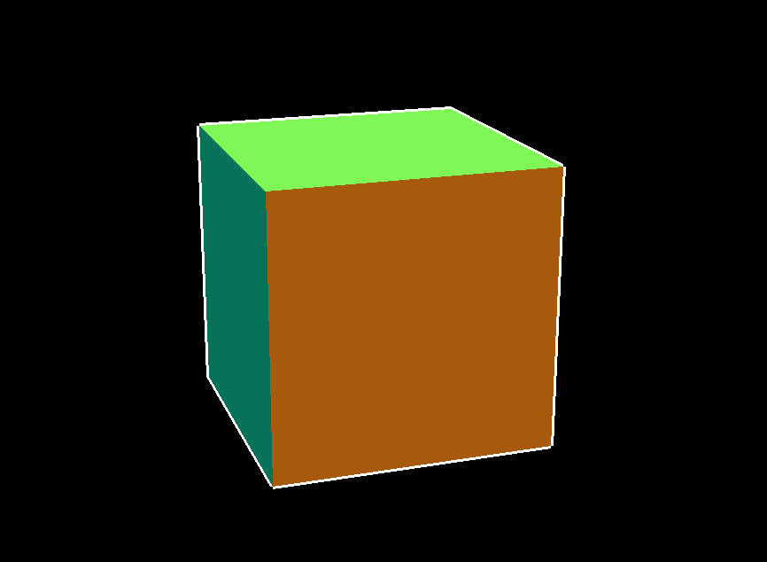

# Renderer

This renderer takes various 3d vertices making up a solid, which are then connected with each other by lines. It also takes quadrilaterals made up of points to draw the various colored surfaces over the object.
It rotates the whole object over time using a rotation matrix.

The sample used in the code is a cube, where the color of the faces is determined by the position of the mean point in the plane, but the code can easily be modified to produce all kinds of other 3d objects with different colorings.

This renderer can be compiled with CMake.

